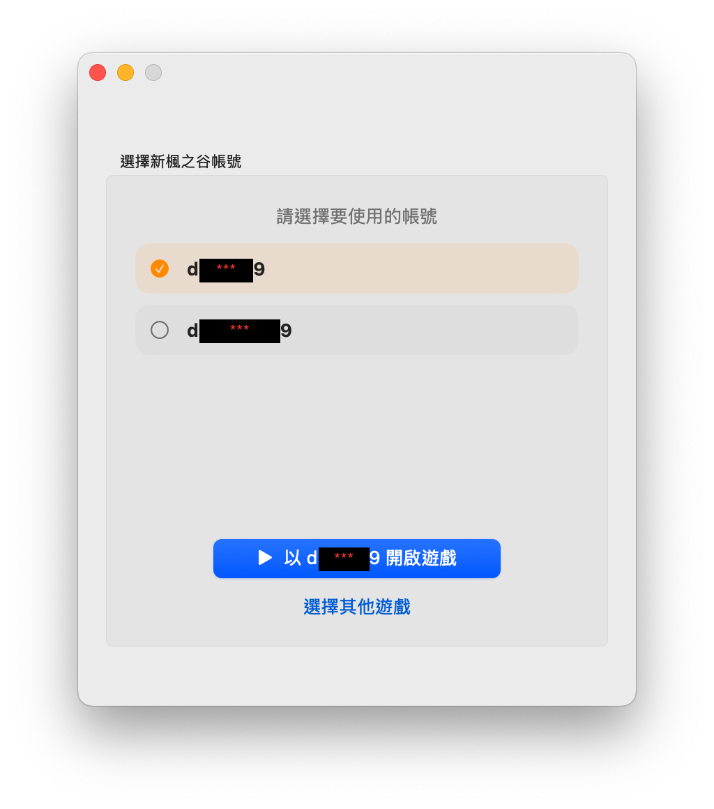

# 在 macOS 玩新楓之谷（玩家教學）

最後更新：2026-07-30

本教學依實際可玩流程整理，目標是讓一般玩家能在 Apple Silicon／Intel Mac 上安裝並啟動**新楓之谷**（台灣 Beanfun 版）。這不是官方支援路徑，遊戲與登入服務隨時可能變更。

新楓之谷：經典版請見 [`docs/macos-player-guide-classic.md`](macos-player-guide-classic.md)。

## 你會用到什麼

| 項目 | 用途 |
| --- | --- |
| Beanfun OTP（本專案 Modern 版，macOS 13+） | QR 登入取得 OTP，並啟動遊戲 |
| 美版 [MapleStory Launcher](https://www.nexon.com/maplestory/) | 跑新楓之谷的官方 OEM Wine（CrossOver 25／Wine 10）與 bottle |
| [Cyder 新楓之谷分支](https://github.com/dspp779/CyderBits/releases/tag/v0.7.0-maplestory)（可選） | 不想裝北美 Nexon Launcher 時，可用此分支版 Cyder 跑**新楓之谷**（oem25；**不能**開經典版） |
| [台灣官方新楓之谷主程式](https://maplestory.beanfun.com/download) | 下載 `MapleStory.exe`（手動下載可略過橘子遊戲管理器；App 內亦可一鍵下載，見下方） |
| Beanfun 帳號 | 登入憑證來源 |

Cyder 下載（經典版／正式版）：<https://github.com/dspp779/CyderBits/releases/latest>

## 哪個環境開哪款（請先看）

| 環境 | 新楓之谷 | 新楓之谷：經典版 |
| --- | --- | --- |
| **北美官方 MapleStory Launcher**（CrossOver 25／Wine 10） | 可用 | **不可用**（缺功能，例：`EventWriteEx`） |
| **[Cyder 新楓之谷分支](https://github.com/dspp779/CyderBits/releases/tag/v0.7.0-maplestory)**（`v0.7.0-maplestory`，oem25） | 可用（可不裝 GMS Launcher） | **不可用**（oem25，缺 `EventWriteEx` 等） |
| **[Cyder 正式版](https://github.com/dspp779/CyderBits/releases/latest)** | **不行**（未含新楓之谷官方修補移植） | 可用（經典版請走此路徑） |

經典版完整步驟見 [`docs/macos-player-guide-classic.md`](macos-player-guide-classic.md)。

研究細節（OEM engine、Cyder、防作弊 lifecycle）見同目錄其他文件；一般遊玩不必閱讀。

## 注意事項（請先看）

1. **安裝路徑請選好找的地方**  
   遊戲若裝進 bottle 的 `Program Files`，之後很難在 Finder 找到。建議裝到 macOS「文件」底下，例如：  
   `~/Documents/gamania Games/MapleStory`  
   Wine 的「我的文件」通常對應你的 macOS `Documents`，選 Documents／文件即可。

2. **啟動參數必須是帳號 ID + OTP**  
   遊戲命令列需要 `ServiceAccountID`（形如 `T9...`）與短期 OTP。  
   **不要**把 Beanfun 顯示名稱或純數字 SN 當成帳號 ID，否則可能畫面正常卻顯示「未登錄的帳號」。

3. **OTP 很快過期**  
   請在取得後立刻啟動；不要把 OTP 寫進長期筆記或分享出去。

4. **Apple Silicon 需要 Rosetta**  
   美版 Launcher 內的 Wine 是 x86_64。若系統尚未安裝 Rosetta，首次開啟相關程式時依提示安裝即可。

5. **繁體中文環境（Wine 路徑）**  
   新楓之谷會檢查繁中 code page。下方 Wine 指令會設定 `zh_TW.UTF-8`；若出現 Traditional Chinese／code-page 相關錯誤，請確認這三個變數都有設上。

---

## 步驟 0：準備目錄（建議）

安裝遊戲時，請指向 macOS「文件」目錄 `$HOME/Documents`（Wine 內通常對應 `C:\users\crossover\Documents`）。此目錄預設已存在，無須額外建立子資料夾。

---

## 步驟 1：準備 Wine 環境（二選一）

新楓之谷需要相容層。可選：

- **A. 北美 MapleStory Launcher**（內建 CrossOver 25／Wine 10）→ Beanfun OTP 用「以 MapleStory Launcher 開啟」
- **B. [Cyder 新楓之谷分支](https://github.com/dspp779/CyderBits/releases/tag/v0.7.0-maplestory)**（`v0.7.0-maplestory`）→ 把 `MapleStory.exe`「打開方式」設成該 Cyder，再用「以 Cyder 開啟」

**請勿**用 [Cyder 正式版](https://github.com/dspp779/CyderBits/releases/latest) 跑新楓之谷（尚未含官方修補移植）。經典版不要用北美 Launcher，也不要用 `v0.7.0-maplestory`（同為 oem25，缺 `EventWriteEx`）。

### 1A. 安裝美版 MapleStory Launcher

1. 到北美楓之谷官方網站下載並安裝 macOS 版 **MapleStory Launcher**：  
   <https://www.nexon.com/maplestory/>  
   安裝說明也可參考 Nexon 支援文件（含 macOS）：  
   <https://support-maplestory.nexon.com/hc/en-us/articles/43855651499284-How-to-install-MapleStory>
2. 開啟 `/Applications/MapleStory Launcher.app`，完成首次啟動。  
   系統會建立 Wine bottle（約在 `~/Library/Application Support/MapleStoryNA/Bottles/maplestory`）。
3. **不必**下載或遊玩美版楓之谷本體；我們只要它的 Wine 環境（CrossOver 25／Wine 10 OEM）。

確認 Wine 工具存在：

```sh
ls "/Applications/MapleStory Launcher.app/Contents/SharedSupport/maplestoryna/MapleStory Launcher/wine"
```

若找不到上述路徑，代表 Launcher 尚未正確安裝。

### 1B. 安裝 Cyder 新楓之谷分支（可不裝 Launcher）

1. 下載：[CyderBits `v0.7.0-maplestory`](https://github.com/dspp779/CyderBits/releases/tag/v0.7.0-maplestory)
2. 安裝後，在 Finder 對 `MapleStory.exe` 設「打開方式」為該 **Cyder**。
3. 在 Beanfun OTP 選「以 Cyder 開啟」。

經典版請改用 [Cyder 正式版](https://github.com/dspp779/CyderBits/releases/latest)；**不要**用本分支（oem25，缺 `EventWriteEx`）。見[經典版教學](macos-player-guide-classic.md)。

---

<details>
  <summary>

  ## 步驟 2：用 Wine 安裝橘子遊戲管理器（手動下載可略過）

  </summary>

若你已從[官方下載頁](https://maplestory.beanfun.com/download)取得主程式，可略過本步驟。

### 2.1 下載安裝檔

1. 開啟：<https://tw.beanfun.com/ggm/index.html>
2. 下載 **gamania Games Manager**（約十數 MB 的 Windows 安裝程式）。
3. 把下載到的 `.exe` 放到好找的位置，例如 `~/Downloads/`。

下列指令假設安裝檔名為 `~/Downloads/GamesManagerSetup.exe`；請依實際檔名修改。

### 2.2 設定環境並執行安裝

在終端機執行：

```sh
export CX_ROOT="/Applications/MapleStory Launcher.app/Contents/SharedSupport/maplestoryna"
export PATH="$CX_ROOT/MapleStory Launcher:$PATH"
export LANG=zh_TW.UTF-8
export LC_ALL=zh_TW.UTF-8
export LC_CTYPE=zh_TW.UTF-8

wine --bottle maplestory \
  --workdir "$HOME/Downloads" \
  "$HOME/Downloads/GamesManagerSetup.exe"
```

安裝精靈注意：

- 安裝路徑請改成例如：`C:\users\crossover\Documents\ggm`  
  （對應 macOS：`~/Documents/ggm`）
- 過程中若提示安裝 **.NET Desktop Runtime / .NET Framework 6**，請接受並完成安裝。
- 安裝完成後，管理器主程式通常是 `GGMWebStart.exe`。
- Beanfun OTP 會在啟動時檢查同 repo 的 GGM manifest 更新，成功後快取到本機；GitHub 暫時不可用時，會回退到本機快取或 app 內建值，不影響原生 OTP 流程。

之後若要再開管理器：

```sh
export CX_ROOT="/Applications/MapleStory Launcher.app/Contents/SharedSupport/maplestoryna"
export PATH="$CX_ROOT/MapleStory Launcher:$PATH"
export LANG=zh_TW.UTF-8
export LC_ALL=zh_TW.UTF-8
export LC_CTYPE=zh_TW.UTF-8

wine --bottle maplestory \
  --workdir "$HOME/Documents/ggm" \
  "$HOME/Documents/ggm/GGMWebStart.exe"
```

若你的實際路徑不同，把上面的 `ggm` 路徑改成你安裝時選的位置。

</details>

---

## 步驟 3：取得並確認新楓之谷主程式

1. **方式 A（App 內下載，建議）** — 在 Beanfun OTP 選「新楓之谷」，按「下載新楓之谷客戶端」，選擇目的地資料夾（建議 `~/Documents/gamania Games/MapleStory`）。App 會先檢查磁碟空間，再透過 [cmsdl](https://github.com/HikariCalyx/cmsdl) 下載並自動設定 `MapleStory.exe` 路徑。整合細節見 [`docs/cmsdl-maplestory-download.md`](cmsdl-maplestory-download.md)。
2. **方式 B（手動）** — 使用[官方主程式下載](https://maplestory.beanfun.com/download)，解壓／安裝到好找的資料夾（例如 `~/Documents/gamania Games/MapleStory`）。
3. 若改用橘子遊戲管理器安裝：登入 Beanfun／選擇**新楓之谷**，把遊戲目錄設到文件底下（詳見上方可收合的步驟 2）。
4. 確認存在：

```sh
ls "$HOME/Documents/gamania Games/MapleStory/MapleStory.exe"
```

路徑可依你實際安裝位置調整。重點是你要能在 Finder 或終端機輕易找到 `MapleStory.exe`。

5. 若走 **Cyder 新楓之谷分支**：在 Finder 對 `MapleStory.exe` 設定「打開方式」為該 Cyder。若走 Launcher Wine，則不必改打開方式。

---

## 步驟 4：用 Beanfun OTP 啟動新楓之谷（建議）

新楓之谷不能只雙擊 `MapleStory.exe`；必須附上 Beanfun 的帳號 ID 與 OTP。

1. 建置或取得 **Beanfun OTP.app**（Modern，macOS 13+；見專案 `README.md`／Release）。
2. 若系統提示「無法驗證開發者」，到「系統設定 → 隱私權與安全性」允許開啟，或對 App 按右鍵 → 打開。（公證過的 Developer ID 建置通常可直接開。）
3. 開啟 App（預設為**一般模式**）：

   **選擇遊戲** — 點「新楓之谷」，第一次會要求指定 `MapleStory.exe`（若尚未安裝，可先按「下載新楓之谷客戶端」）：

   

   **登入 Beanfun** — 用 Gama Play App 掃描 QR Code：

   

   **選擇帳號並啟動** — 選要進入的遊戲帳號後，新楓之谷會出現兩個按鈕：

   - **以 MapleStory Launcher 開啟**：設定 Wine 環境後，直接執行 Launcher 內建 `wine`（`maplestory` bottle），**不會**走 `open`。需已完成步驟 1A。
   - **以 Cyder 開啟**：透過 macOS `open -n`，依 `.exe` 的「打開方式」啟動。  
     請使用 [Cyder 新楓之谷分支](https://github.com/dspp779/CyderBits/releases/tag/v0.7.0-maplestory)（步驟 1B）；**正式版 Cyder 不能跑新楓之谷**。

   

   啟動後按鈕會暫時停用約 10 秒，並顯示「啟動中…／已啟動」。

4. **進階模式**（可選）— 從選單「模式」切換後可複製完整終端機指令，並在 `open` 與 **Nexon MapleStory Launcher Wine** 兩種形式間切換。  
   走 Launcher 時用 Wine 形式；走 Cyder 新楓之谷分支時用 `open` 形式。

若工具介面有變，請改用下方手動指令。

---

## 步驟 5：手動啟動新楓之谷（備援）

遊戲命令列格式固定為：

```text
MapleStory.exe tw.login.maplestory.beanfun.com 8484 BeanFun <ServiceAccountID> <OTP>
```

### 5.1 MapleStory Launcher Wine

在終端機（請替換帳號 ID、OTP，以及遊戲路徑）：

```sh
export CX_ROOT="/Applications/MapleStory Launcher.app/Contents/SharedSupport/maplestoryna"
export PATH="$CX_ROOT/MapleStory Launcher:$PATH"
export LANG=zh_TW.UTF-8
export LC_ALL=zh_TW.UTF-8
export LC_CTYPE=zh_TW.UTF-8

GAME_DIR="$HOME/Documents/gamania Games/MapleStory"
ACCOUNT_ID='T9你的帳號ID'
OTP='一次性OTP'

wine --bottle maplestory \
  --wait-children --enable-alt-loader macdrv \
  --workdir "$GAME_DIR" \
  "$GAME_DIR/MapleStory.exe" \
  tw.login.maplestory.beanfun.com 8484 BeanFun "$ACCOUNT_ID" "$OTP"
```

重點：

- `--workdir` 必須是 `MapleStory.exe` 所在目錄。
- `ACCOUNT_ID` 必須與該次 OTP 綁定的帳號一致。
- OTP 用過即失效；失敗時重新向 Beanfun／Beanfun OTP 取得一組再試。

### 5.2 Cyder／`open`（需新楓之谷分支）

請先安裝 [Cyder `v0.7.0-maplestory`](https://github.com/dspp779/CyderBits/releases/tag/v0.7.0-maplestory)，並將 `MapleStory.exe` 的「打開方式」設為該 Cyder。**正式版不能跑新楓之谷。**

```sh
open -n '/path/to/MapleStory.exe' --args \
  tw.login.maplestory.beanfun.com 8484 BeanFun 'T9你的帳號ID' '一次性OTP'
```

經典版請用 [Cyder 正式版](https://github.com/dspp779/CyderBits/releases/latest)；見 [`docs/macos-player-guide-classic.md`](macos-player-guide-classic.md)。

---

## 常見問題

| 現象 | 可能原因 | 怎麼辦 |
| --- | --- | --- |
| 找不到遊戲或管理器 | 裝進 bottle 的 Program Files | 重裝並改裝到 `Documents`；或用 Finder 搜尋 `MapleStory.exe`／`GGMWebStart.exe` |
| 錯誤 5 | 沒帶有效 OTP | 用 Beanfun OTP 或手動指令帶上新 OTP |
| 「未登錄的帳號」 | 傳了顯示名稱／錯的 ID，或 ID 與 OTP 不符 | 改用該帳號的 `T9...` ServiceAccountID |
| Traditional Chinese／code-page 錯誤 | locale 不是繁中 | 確認 `LANG`／`LC_ALL`／`LC_CTYPE` 皆為 `zh_TW.UTF-8` 後再啟動 |
| `wine: command not found` | 未設定 `PATH`／未裝 Launcher | 重新執行步驟 2 的 `export`，或確認 Launcher 已安裝 |
| Apple Silicon 打不開 x86 程式 | 未裝 Rosetta | 依系統提示安裝 Rosetta 2 |
| 管理器裝完無法執行 | 缺少 .NET 6 | 回到安裝流程接受 .NET 元件，或再執行一次安裝程式補裝 |
| 「以 MapleStory Launcher 開啟」失敗 | 未裝／未開過 Launcher | 完成步驟 1A，確認 `wine` 路徑存在；或改用步驟 1B（Cyder 新楓之谷分支） |
| 「以 Cyder 開啟」失敗／進不了遊戲 | 用了正式版 Cyder，或未設打開方式 | 改裝 [`v0.7.0-maplestory`](https://github.com/dspp779/CyderBits/releases/tag/v0.7.0-maplestory)，或改用「以 MapleStory Launcher 開啟」 |
| 想用 Launcher 或 Cyder 新楓之谷分支開經典版 | 皆為 oem25／CrossOver 25（Wine 10），缺 `EventWriteEx` 等 | 經典版請改用 [Cyder 正式版](https://github.com/dspp779/CyderBits/releases/latest)；見[經典版教學](macos-player-guide-classic.md) |

---

## 路徑速查

以下為本教學建議／已驗證的常見位置（使用者名稱請自行對應）：

```text
MapleStory Launcher.app
  /Applications/MapleStory Launcher.app

OEM Wine（cxstart / wine）— 新楓之谷可選路徑之一（CrossOver 25／Wine 10）
  .../Contents/SharedSupport/maplestoryna/MapleStory Launcher/

Bottle
  ~/Library/Application Support/MapleStoryNA/Bottles/maplestory

建議：遊戲管理器
  ~/Documents/ggm/GGMWebStart.exe

建議：新楓之谷
  ~/Documents/gamania Games/MapleStory/MapleStory.exe
```

---

## 免責

- 本流程使用北美 MapleStory Launcher 內建 Wine（CrossOver 25／Wine 10）及／或 [Cyder 新楓之谷分支](https://github.com/dspp779/CyderBits/releases/tag/v0.7.0-maplestory)（oem25）執行 Windows 版新楓之谷客戶端，可能違反遊戲服務條款，也有帳號風險。
- **Cyder 正式版**不能跑新楓之谷；**北美 Launcher 與 Cyder 新楓之谷分支都不能開經典版**（缺 `EventWriteEx` 等），見[經典版教學](macos-player-guide-classic.md)。
- Nexon、遊戲橘子、Beanfun 皆未為此 macOS 玩法提供官方支援。
- OTP、Cookie、帳號 ID 屬敏感資料，請勿貼到公開頻道或提交到任何版本庫。

經典版請見 [`docs/macos-player-guide-classic.md`](macos-player-guide-classic.md)。
